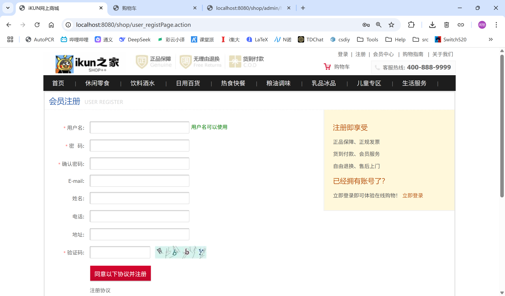
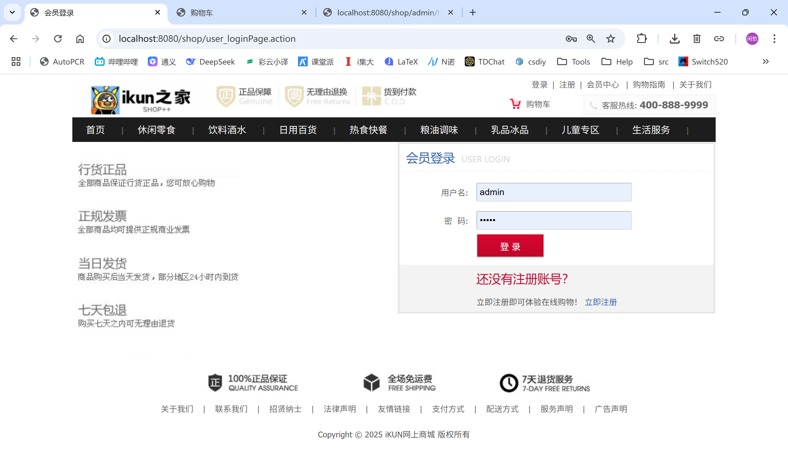
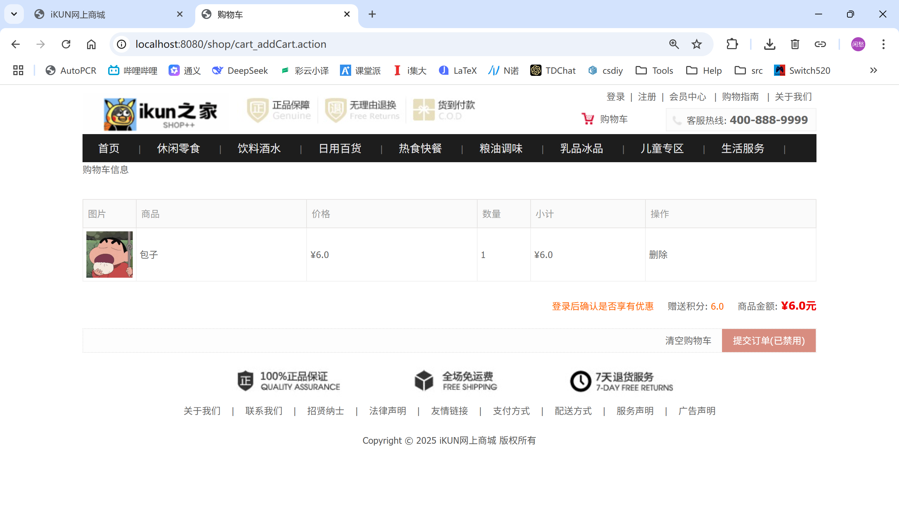
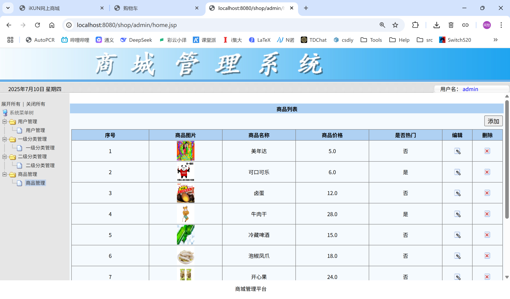

# 🛒 iKUN商城系统

[](https://github.com/your-repo/shop)
[](https://www.oracle.com/java/)
[](https://spring.io/)
[](LICENSE)

> 🎯 基于SSH（Spring + Struts2 + Hibernate）架构的B2C电商购物平台，提供完整的在线购物体验

## 📋 目录

- [📖 项目简介](#📖-项目简介)
- [✨ 功能特性](#✨-功能特性)
- [🛠 技术栈](#🛠-技术栈)
- [📁 项目结构](#📁-项目结构)
- [🔧 环境要求](#🔧-环境要求)
- [🚀 快速开始](#🚀-快速开始)
- [💾 数据库设计](#💾-数据库设计)
- [🎯 功能模块](#🎯-功能模块)
- [📸 项目截图](#📸-项目截图)
- [🔧 配置说明](#🔧-配置说明)
- [🚦 部署指南](#🚦-部署指南)
- [🤝 贡献指南](#🤝-贡献指南)
- [📄 许可证](#📄-许可证)

---

## 📖 项目简介

iKUN商城是一个功能完善的B2C电商购物平台，采用经典的SSH框架架构开发。系统包含用户端和管理端两个部分，支持商品浏览、购物车管理、订单处理、用户管理等核心电商功能。

### 🎯 项目特点

- 🏗️ **经典架构**: 采用SSH框架，技术成熟稳定
- 🛒 **功能完整**: 包含完整的电商业务流程
- 👥 **双端设计**: 用户端 + 管理端，满足不同用户需求
- 🎨 **界面友好**: 现代化UI设计，用户体验良好
- 🔒 **安全可靠**: 完善的用户认证和权限控制
- 📱 **响应式**: 支持多种设备访问

---

## ✨ 功能特性

### 🛍️ 前台用户功能

| 模块 | 功能 | 描述 |
|------|------|------|
| 👤 **用户管理** | 注册/登录/退出 | 支持用户注册、登录验证 |
| 📂 **商品分类** | 多级分类浏览 | 一级分类、二级分类商品展示 |
| 🛒 **商品展示** | 热门/最新商品 | 首页展示、详情查看、分页浏览 |
| 🛍️ **购物车** | 购物车管理 | 添加商品、数量调整、结算功能 |

### ⚙️ 后台管理功能

| 模块 | 功能 | 描述 |
|------|------|------|
| 👥 **用户管理** | CRUD操作 | 用户信息管理、状态控制 |
| 📂 **分类管理** | 分类维护 | 一级/二级分类的增删改查 |
| 📦 **商品管理** | 商品维护 | 商品信息管理、图片上传 |
| 📈 **数据统计** | 业务分析 | 销售统计、用户分析 |

---

---

## 🔧 环境要求

| 环境 | 版本要求 | 说明 |
|------|----------|------|
| ☕ **JDK** | 1.8+ | Java开发环境 |
| 🔨 **Maven** | 3.3+ | 项目构建工具 |
| 🗄️ **MySQL** | 5.x/8.x | 数据库服务 |
| 🖥️ **Tomcat** | 7+ | Web应用服务器 |
| 💻 **IDE** | IntelliJ IDEA 2020+ | 推荐开发环境 |

---

## 🚀 快速开始

### 1️⃣ 环境准备

确保你的开发环境已安装：
- ☕ JDK 1.8+
- 🔨 Maven 3.3+
- 🗄️ MySQL 5.x+
- 💻 IntelliJ IDEA

### 2️⃣ 获取项目

```bash
# 克隆项目到本地
git clone <repository-url>
cd iKUN商城/shop
```

### 3️⃣ 导入IDE

1. 打开 IntelliJ IDEA
2. 选择 `File` → `Open`
3. 选择项目根目录下的 `pom.xml` 文件
4. 选择 "Open as Project"
5. 等待 Maven 依赖下载完成

### 4️⃣ 数据库配置

#### 4.1 创建数据库
```sql
-- 创建数据库
CREATE DATABASE shop CHARACTER SET utf8mb4 COLLATE utf8mb4_unicode_ci;
```

#### 4.2 导入数据表
```bash
# 在MySQL中执行
mysql -u root -p shop < shop.sql
```

#### 4.3 配置连接信息
编辑 `src/main/resources/jdbc.properties`：
```properties
# MySQL数据库配置
jdbc.driver=com.mysql.cj.jdbc.Driver
jdbc.url=jdbc:mysql://localhost:3306/shop?useUnicode=true&characterEncoding=utf8&useSSL=false&serverTimezone=Asia/Shanghai
jdbc.username=root
jdbc.password=your_password


### 5️⃣ 运行项目

#### Maven命令行
```bash
# 清理并编译
mvn clean compile

# 运行项目（使用内置Tomcat）
mvn tomcat7:run

# 或者打包部署
mvn clean package
```


### 6️⃣ 访问应用

- 🏠 **前台首页**: http://localhost:8080/shop
- ⚙️ **后台管理**: http://localhost:8080/shop/admin
- 👤 **默认管理员**: admin / admin

---

## 💾 数据库设计

### 📊 数据库架构

本系统采用MySQL数据库，包含5张核心数据表：

| 表名 | 中文名 | 功能描述 |
|------|--------|----------|
| `user` | 用户表 | 存储前台用户基本信息 |
| `adminuser` | 管理员表 | 存储后台管理员信息 |
| `category` | 一级分类表 | 商品一级分类管理 |
| `categorysecond` | 二级分类表 | 商品二级分类管理 |
| `product` | 商品表 | 商品详细信息存储 |

### 🔗 表关系设计

```
category (一级分类)
    ↓ 1:N
categorysecond (二级分类)
    ↓ 1:N
product (商品)

user (用户) ←→ order (订单) ←→ orderitem (订单项) ←→ product (商品)
```

### 📋 核心表结构

#### 用户表 (user)
```sql
CREATE TABLE `user` (
  `uid` int NOT NULL AUTO_INCREMENT COMMENT '用户ID',
  `username` varchar(255) DEFAULT NULL COMMENT '用户名',
  `password` varchar(255) DEFAULT NULL COMMENT '密码',
  `name` varchar(255) DEFAULT NULL COMMENT '真实姓名',
  `email` varchar(255) DEFAULT NULL COMMENT '邮箱',
  `phone` varchar(255) DEFAULT NULL COMMENT '电话',
  `addr` varchar(255) DEFAULT NULL COMMENT '地址',
  PRIMARY KEY (`uid`),
  UNIQUE KEY `username` (`username`)
);
```

#### 商品表 (product)
```sql
CREATE TABLE `product` (
  `pid` int NOT NULL AUTO_INCREMENT COMMENT '商品ID',
  `pname` varchar(255) DEFAULT NULL COMMENT '商品名称',
  `market_price` double DEFAULT NULL COMMENT '市场价格',
  `shop_price` double DEFAULT NULL COMMENT '商城价格',
  `image` varchar(255) DEFAULT NULL COMMENT '商品图片',
  `pdesc` varchar(255) DEFAULT NULL COMMENT '商品描述',
  `is_hot` int DEFAULT '0' COMMENT '是否热门(0:否 1:是)',
  `pdate` datetime DEFAULT NULL COMMENT '上架时间',
  `csid` int DEFAULT NULL COMMENT '二级分类ID',
  PRIMARY KEY (`pid`),
  KEY `FK_product_categorysecond` (`csid`),
  CONSTRAINT `FK_product_categorysecond` FOREIGN KEY (`csid`) REFERENCES `categorysecond` (`csid`)
);
```

> 📖 **详细设计文档**: [数据库设计文档](doc/数据库设计文档.md)

---

## 🎯 功能模块

### 🛍️ 前台功能
#### 1. 用户注册与登录


- ✅ 用户注册（用户名唯一性检查）
- 🔍 图形验证码
- 🚪 安全退出

#### 2. 商品浏览

- 🏠 首页商品展示（热门商品、最新商品）
- 📂 按分类浏览商品
- 🔍 商品搜索功能
- 📋 商品详情查看
- 📄 分页显示


#### 3. 购物车功能

- ➕ 添加商品到购物车
- 📝 修改商品数量
- ❌ 移除购物车商品
- 💰 实时计算总价
- 🛒 购物车结算


### ⚙️ 后台管理

#### 1. 用户管理
- 👥 用户列表查询
- ✏️ 用户信息编辑
- 🔄 用户状态管理
- ❌ 用户删除

#### 2. 商品管理
- ➕ 添加新商品
- ✏️ 编辑商品信息
- 🖼️ 商品图片上传
- ❌ 删除商品
- 🔥 设置热门商品

#### 3. 分类管理
- 📂 一级分类管理
- 🗂️ 二级分类管理
- 🔗 分类关联设置
---

## 📸 项目截图

### 🏠 前台页面

| 页面 | 描述 |
|------|------|
| 🏠 首页 | 商品展示、分类导航、热门推荐 |
| 👤 注册页面 | 用户注册表单、邮箱验证 |
| 🔐 登录页面 | 用户登录、验证码 |
| 📦 商品详情 | 商品图片、价格、描述、购买 |
| 🛒 购物车 | 商品列表、数量调整、结算 |

### ⚙️ 后台管理

| 页面 | 描述 |
|------|------|
| 📊 管理首页 | 数据统计、快捷操作 |
| 👥 用户管理 | 用户列表、编辑、状态管理 |
| 📦 商品管理 | 商品列表、添加、编辑 |
| 📂 分类管理 | 分类树形结构管理 |

---

---

## 📄 许可证

本项目采用 MIT 许可证 - 查看 [LICENSE](LICENSE) 文件了解详情。


<div align="center">

**⭐ 如果这个项目对你有帮助，请给它一个star！ ⭐**

</div>
