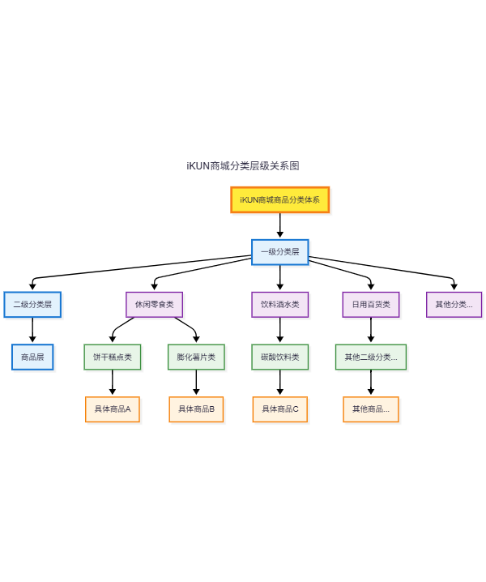
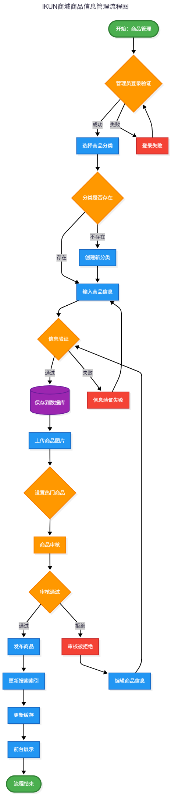

# iKUN商城系统数据库设计文档

## 1. 文档概述

### 1.1 文档信息

| 项目 | 内容 |
|------|------|
| **项目名称** | iKUN商城系统 |
| **文档类型** | 数据库设计文档 |
| **版本号** | v1.0 |
| **编写日期** | 2025年7月10日 |
| **文档状态** | 正式版 |

### 1.2 设计目标

本文档旨在规范iKUN商城系统的数据库设计，确保：

- 📊 **业务支持**：支持完整的电商业务流程
- 🔒 **数据完整性**：保证数据的一致性和完整性  
- ⚡ **性能优化**：优化查询性能，提升用户体验
- 🔧 **可维护性**：支持系统扩展和维护
- 🛡️ **安全保障**：确保数据安全性

### 1.3 技术规范

| 技术项 | 配置信息 |
|--------|----------|
| **数据库管理系统** | MySQL 8.0 |
| **字符集** | UTF8MB4 |
| **存储引擎** | InnoDB |
| **外键约束** | 启用 |
| **事务支持** | ACID特性 |

---

## 2. 数据库总体设计

### 2.1 数据库架构图


> **图片说明**：
> - 📋 包含所有5张表：user、category、categorysecond、product、adminuser
> - 🔗 显示表之间的外键关联关系
> - 🔑 标注主键和外键字段
> - 🎨 使用不同颜色区分不同功能模块的表

### 2.2 模块划分

数据库按功能模块划分为以下几个部分：

| 模块名称 | 包含表 | 功能描述 |
|---------|--------|----------|
| 用户管理模块 | user, adminuser | 管理前台用户和后台管理员信息 |
| 商品分类模块 | category, categorysecond | 管理商品的一级和二级分类 |
| 商品管理模块 | product | 管理商品基本信息 |

### 2.3 命名规范

| 类型 | 规则 | 示例 |
|------|------|------|
| **表名** | 全小写，多个单词用下划线分隔 | `user_profile`, `order_item` |
| **字段名** | 全小写，多个单词用下划线分隔 | `user_name`, `create_time` |
| **主键** | 表名前缀+id | `uid`, `cid`, `pid` |
| **外键** | 关联表的主键名称 | `cid`, `csid` |
| **索引** | idx_表名_字段名 | `idx_user_username` |

---

## 3. 表结构详细设计

### 3.1 用户表 (user)

> **表功能**：存储前台用户的基本信息，支持用户注册、登录、个人信息管理等功能。

#### 表结构设计

| 字段名 | 数据类型 | 长度 | 是否为空 | 默认值 | 主键 | 外键 | 说明 |
|--------|----------|------|----------|---------|------|------|------|
| uid | int | 11 | NOT NULL | AUTO_INCREMENT | ✓ | | 用户唯一标识 |
| username | varchar | 255 | NULL | | | | 用户登录名，需唯一 |
| password | varchar | 255 | NULL | | | | 用户密码（无加密存储） |
| name | varchar | 255 | NULL | | | | 用户真实姓名 |
| email | varchar | 255 | NULL | | | | 用户邮箱地址 |
| phone | varchar | 255 | NULL | | | | 用户手机号码 |
| addr | varchar | 255 | NULL | | | | 用户地址信息 |

#### 索引设计
```sql
-- 主键索引
PRIMARY KEY (`uid`)

-- 唯一索引
UNIQUE KEY `idx_username` (`username`)

-- 普通索引
KEY `idx_email` (`email`)
```

#### 业务规则
- ✅ username必须唯一，用于登录验证
- ⚠️ 密码采用明文存储（后续增加加密处理）
- 📧 邮箱格式需要前端和后端双重验证

---

### 3.2 管理员表 (adminuser)

> **表功能**：存储后台管理员信息，用于后台系统的权限控制。

#### 表结构设计

| 字段名 | 数据类型 | 长度 | 是否为空 | 默认值 | 主键 | 外键 | 说明 |
|--------|----------|------|----------|---------|------|------|------|
| uid | int | 11 | NOT NULL | AUTO_INCREMENT | ✓ | | 管理员唯一标识 |
| username | varchar | 255 | NULL | | | | 管理员用户名 |
| password | varchar | 255 | NULL | | | | 管理员密码 |

#### 索引设计
```sql
-- 主键索引
PRIMARY KEY (`uid`)

-- 唯一索引
UNIQUE KEY `idx_admin_username` (`username`)
```

#### 业务规则
- 🔐 管理员用户名必须唯一
- 🛡️ 密码需要加密存储
- 🎯 用于后台管理系统的登录验证

#### 示例数据
```sql
INSERT INTO adminuser VALUES (2, 'admin', 'admin');
```

---

### 3.3 一级分类表 (category)

> **表功能**：存储商品的一级分类信息，构建商品分类体系的顶层结构。

#### 表结构设计

| 字段名 | 数据类型 | 长度 | 是否为空 | 默认值 | 主键 | 外键 | 说明 |
|--------|----------|------|----------|---------|------|------|------|
| cid | int | 11 | NOT NULL | AUTO_INCREMENT | ✓ | | 一级分类唯一标识 |
| cname | varchar | 255 | NULL | | | | 一级分类名称 |

#### 索引设计
```sql
-- 主键索引
PRIMARY KEY (`cid`)

-- 普通索引
KEY `idx_cname` (`cname`)
```

#### 业务规则
- 🏗️ 一级分类为商品分类的顶层结构
- ⚠️ 删除一级分类会级联影响二级分类和商品
- 📝 分类名称建议控制在50字符以内

#### 示例数据
```
休闲零食、饮料酒水、日用百货、热食快餐、
粮油调味、乳品冰品、儿童专区、生活服务
```



---

### 3.4 二级分类表 (categorysecond)

> **表功能**：存储商品的二级分类信息，提供更细粒度的商品分类。

#### 表结构设计

| 字段名 | 数据类型 | 长度 | 是否为空 | 默认值 | 主键 | 外键 | 说明 |
|--------|----------|------|----------|---------|------|------|------|
| csid | int | 11 | NOT NULL | AUTO_INCREMENT | ✓ | | 二级分类唯一标识 |
| csname | varchar | 255 | NULL | | | | 二级分类名称 |
| cid | int | 11 | NULL | | | ✓ | 所属一级分类ID |

#### 索引设计
```sql
-- 主键索引
PRIMARY KEY (`csid`)

-- 外键索引
KEY `idx_cid` (`cid`)

-- 普通索引
KEY `idx_csname` (`csname`)
```

#### 外键约束
```sql
CONSTRAINT FK936FCAF21DB1FD15 
FOREIGN KEY (cid) REFERENCES category (cid)
```

#### 业务规则
- 🔗 每个二级分类必须属于某个一级分类
- ⚠️ 删除一级分类时应检查是否存在关联的二级分类
- 📦 二级分类下可以挂载多个商品

#### 分类示例
| 一级分类 | 二级分类 |
|----------|----------|
| 休闲零食 | 饼干糕点、膨化薯片、糖果巧克力、坚果炒货、肉干卤味 |
| 饮料酒水 | 碳酸饮料、矿泉水纯净水、茶饮料、果汁饮品、功能饮料 |

---

### 3.5 商品表 (product)

> **表功能**：存储商品的详细信息，是系统的核心业务表。

#### 表结构设计

| 字段名 | 数据类型 | 长度 | 是否为空 | 默认值 | 主键 | 外键 | 说明 |
|--------|----------|------|----------|---------|------|------|------|
| pid | int | 11 | NOT NULL | AUTO_INCREMENT | ✓ | | 商品唯一标识 |
| pname | varchar | 255 | NULL | | | | 商品名称 |
| market_price | double | | NULL | | | | 市场参考价格 |
| shop_price | double | | NULL | | | | 商城销售价格 |
| image | varchar | 255 | NULL | | | | 商品图片路径 |
| pdesc | varchar | 255 | NULL | | | | 商品详细描述 |
| is_hot | int | 11 | NULL | 0 | | | 是否热门商品：0-否，1-是 |
| pdate | datetime | | NULL | | | | 商品上架时间 |
| csid | int | 11 | NULL | | | ✓ | 所属二级分类ID |

#### 索引设计
```sql
-- 主键索引
PRIMARY KEY (`pid`)

-- 外键索引
KEY `idx_csid` (`csid`)

-- 业务索引
KEY `idx_is_hot` (`is_hot`)
KEY `idx_pdate` (`pdate`)
KEY `idx_pname` (`pname`)
```

#### 外键约束
```sql
CONSTRAINT FKED8DCCEFB9B74E02 
FOREIGN KEY (csid) REFERENCES categorysecond (csid)
```

#### 业务规则
- 🔗 每个商品必须属于某个二级分类
- 💰 shop_price为实际销售价格，应小于等于market_price
- 🔥 is_hot字段用于首页热门商品展示
- 🖼️ image字段存储相对路径，如 `products/1.png`
- 📅 pdate用于最新商品排序



---

## 4. 数据库关系设计

### 4.1 实体关系图

> *在此处应插入完整的ER图，展示所有表之间的关系*

**图片要求**：
- 📊 使用标准ER图符号
- 🔍 清晰标注实体、属性、关系
- 🔢 显示基数关系（1:1, 1:N, M:N）

### 4.2 关系说明

#### 一对多关系
1. **category → categorysecond**：一个一级分类可以有多个二级分类
2. **categorysecond → product**：一个二级分类可以有多个商品

#### 关系完整性约束
- ✅ **参照完整性**：外键必须引用存在的主键值
- 🔄 **级联操作**：删除父记录时的处理策略
- 📋 **业务规则约束**：如数据格式检查等


---

## 5. 索引设计

### 5.1 主键索引
- 🔑 所有表都有主键索引，使用AUTO_INCREMENT自增长策略

### 5.2 外键索引
为所有外键字段创建索引，提高关联查询性能：
- `categorysecond.cid`
- `product.csid`

### 5.3 业务索引

#### 用户表索引
```sql
CREATE UNIQUE INDEX idx_username ON user(username);
CREATE INDEX idx_email ON user(email);
```

#### 商品表索引
```sql
CREATE INDEX idx_is_hot ON product(is_hot);
CREATE INDEX idx_pdate ON product(pdate);
CREATE INDEX idx_pname ON product(pname);
```

### 5.4 复合索引

#### 商品查询优化
```sql
CREATE INDEX idx_product_category_hot 
ON product(csid, is_hot, pdate);
```

---

## 6. 存储过程和视图

### 6.1 常用视图

#### 商品详情视图
```sql
CREATE VIEW v_product_detail AS
SELECT 
    p.pid, p.pname, p.market_price, p.shop_price, 
    p.image, p.pdesc, p.is_hot, p.pdate,
    cs.csname, c.cname
FROM product p
JOIN categorysecond cs ON p.csid = cs.csid
JOIN category c ON cs.cid = c.cid;
```

### 6.2 存储过程

#### 商品统计存储过程
```sql
DELIMITER //
CREATE PROCEDURE sp_product_statistics(
    IN category_id INT
)
BEGIN
    SELECT 
        cs.csname as category_name,
        COUNT(*) as product_count,
        AVG(shop_price) as avg_price
    FROM product p
    JOIN categorysecond cs ON p.csid = cs.csid
    WHERE cs.cid = category_id
    GROUP BY cs.csid, cs.csname
    ORDER BY product_count DESC;
END //
DELIMITER ;
```

---


## 10. 数据字典

### 10.1 字段类型标准

| 数据类型 | 使用场景 | 示例 |
|---------|----------|------|
| INT | 主键、外键、计数 | uid, pid, count |
| VARCHAR(255) | 一般文本字段 | username, pname |
| VARCHAR(50) | 短文本字段 | name, phone |
| TEXT | 长文本描述 | pdesc |
| DECIMAL(10,2) | 价格、金额 | shop_price, total |
| DATETIME | 时间戳 | ordertime, pdate |

### 10.2 状态码定义

#### 商品热门标识 (product.is_hot)
| 值 | 含义 | 说明 |
|----|------|------|
| 0 | 普通商品 | 默认值 |
| 1 | 热门商品 | 用于首页展示 |

---

